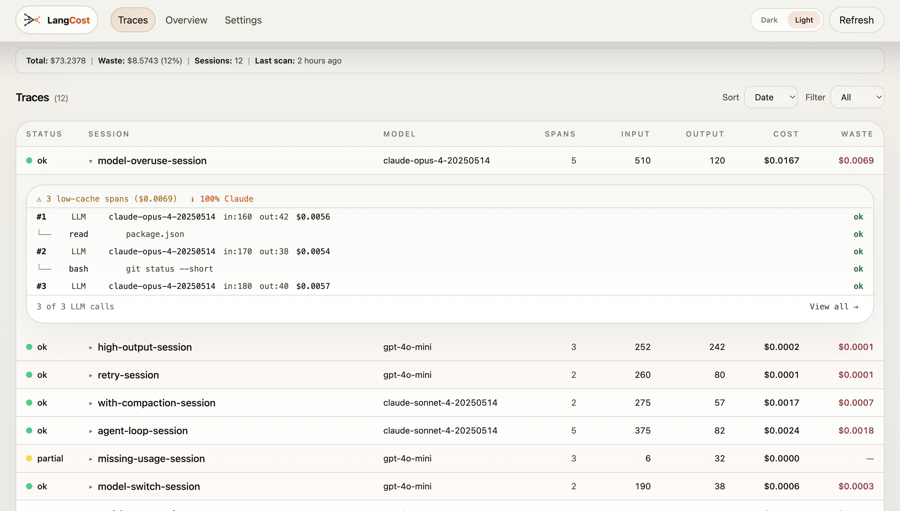

<h1 align="center">
  
  &nbsp;
  LangCost
</h1>

<p align="center">
  <strong>Cost intelligence for AI agents.</strong>
  <br/>
  See where your tokens go. Find the waste. Fix it.
</p>

<p align="center">
  <a href="#quick-start"></a>&nbsp;
  <a href="#adapters"></a>&nbsp;
  <a href="#features"></a>&nbsp;
  <a href="#dashboard"></a>&nbsp;
  <a href="#cli-reference"></a>
</p>

<p align="center">
  
  
  
  
</p>

<br/>

<p align="center">
  
</p>

<br/>

---

<br/>

## Why LangCost?

Your LLM bill keeps climbing — but your provider dashboard only shows total tokens.

It doesn't show that your agent **looped 12 times** on the same tool call, or that **30% of output tokens** were unnecessarily verbose, or that **prompt caching wasn't working**. It doesn't tell you *which session* burned $40 or *why* a trace failed.

LangCost reads your agent logs and tells you exactly what's wasting money:

```
Scanned 12 sessions
├── 12 traces, 1,812 spans, 1,948 messages
├── Total cost: $73.24
├── Estimated waste: $8.60 (11.7%)
└── Top waste: high_output (72.7%), tool_failure_waste (26.7%), low_cache (0.6%)
```

> **No API keys. No cloud. Everything runs locally. Your data never leaves your machine.**

<br/>

---

<br/>

## Quick Start

**Pick your adapter, then three commands.**

```bash
# Install the CLI + the adapter for your agent framework
npm install -g langcost @langcost/adapter-claude-code
# or: npm install -g langcost @langcost/adapter-openclaw
# or: npm install -g langcost @langcost/adapter-warp

# Scan your sessions
langcost scan --source claude-code
# or: langcost scan --source openclaw
# or: langcost scan --source warp

# Open the dashboard
langcost dashboard
```

LangCost auto-detects your agent's data directory, ingests your sessions, runs waste analysis, and serves a local dashboard at `http://localhost:3737`.

> **Why two packages?** `langcost` is the core engine — analysis, dashboard, and reports. Adapters are plugins that read data from specific agent frameworks. Install only what you use.

<details>
<summary><strong>More options</strong></summary>

```bash
# Point to a custom data directory
langcost scan --source claude-code --path /path/to/sessions

# Analyze a single session file
langcost scan --source claude-code --file /path/to/session.jsonl

# Scan older sessions (default is last 30 days)
langcost scan --source claude-code --since 90d
# For Warp scans, choose credit-rate assumptions for arbitrage reporting
langcost scan --source warp --warp-plan business

# Force re-analysis of everything
langcost scan --source claude-code --force
```

</details>

<br/>

---

<br/>

## Adapters

LangCost uses a plugin architecture — adapters translate agent-specific data into a normalized format the analysis engine understands. Install only the adapters you need.

| Adapter | Install | Source | What it reads |
|---------|---------|--------|---------------|
| **Claude Code** | `@langcost/adapter-claude-code` | `~/.claude/projects/` | JSONL session logs from the Claude Code CLI |
| **OpenClaw** | `@langcost/adapter-openclaw` | `~/.openclaw/` | JSONL session logs from OpenClaw agents |
| **Warp** | `@langcost/adapter-warp` | `~/Library/Group Containers/.../warp.sqlite` | Oz agent sessions from Warp's local SQLite database |

```bash
# Use multiple adapters — scan from different sources into the same DB
langcost scan --source claude-code
langcost scan --source openclaw
langcost dashboard  # unified view across all sources
```

### Build your own adapter

Any npm package named `@langcost/adapter-<name>` that exports a default implementing `IAdapter` from `@langcost/core` is automatically discovered by the CLI.

```bash
# The CLI discovers your adapter automatically — no registration needed
npm install -g @langcost/adapter-langfuse
langcost scan --source langfuse
```

See [Contributing](#contributing) for the full adapter spec.

<br/>

---

<br/>

## Features

### Waste Detection

Six rules that automatically find wasted spend in every session:

| | Rule | What it finds |
|:---:|------|-------------|
| 🔴 | **Tool Failures** | Failed tool calls that burned tokens for nothing — `bash: command not found`, 12 calls failed, **$1.65 wasted** |
| 🟡 | **Agent Loops** | Agent stuck calling the same tools in a cycle — `read → bash → read → bash` repeated 8 times |
| 🟡 | **Retry Patterns** | User re-prompting because the agent failed — 3 similar messages in a row, agent struggling |
| 🟠 | **High Output** | Spans with output 3x+ the session average — one response used 4,200 tokens when peers averaged 380 |
| 🟢 | **Low Cache** | Prompt caching disabled or underused — paying full input price on every call |
| 🔵 | **Model Insight** | Flags expensive model usage — 100% Opus usage, helps you decide when cheaper models suffice |

Every finding includes the **dollar amount wasted** and a **specific recommendation** to fix it.

<br/>

### Trace Explorer

Expand any session to see the full execution timeline — every LLM call and tool call in order:

```
#1   LLM   opus-4-5   in:2.8K  out:141   $0.017   ok
 ├── read   README.md                                ok
 └── read   src/main.ts                              ok
#2   LLM   opus-4-5   in:5.2K  out:380   $0.083   ok
 ├── bash   ls -la                                   ok
 ├── write  src/fix.ts                               ok
 └── bash   bun test                                 ✗ error
#3   LLM   opus-4-5   in:8.1K  out:520   $0.130   ok
 └── edit   src/fix.ts                               ok
```

Read exactly what the agent did, which tools it called, what failed, and what each step cost.

<br/>

### Dashboard

A local web UI at `localhost:3737`:

- **Trace table** — all sessions with cost, waste, status. Sortable and filterable.
- **Expandable rows** — click to see waste findings + execution timeline inline
- **Cost overview** — total spend, waste percentage, cost-over-time chart
- **Model insights** — which models you're using and what they cost
- **Recommendations** — prioritized list of what to fix first

<br/>

### CLI Reports

```bash
# All sessions sorted by cost
langcost report --sort cost
```

```
Trace                    │ Model    │   Cost │  Waste │ Status
─────────────────────────┼──────────┼────────┼────────┼────────
before-compaction        │ opus-4-5 │ $42.60 │  $6.03 │ error
expensive-session        │ opus-4   │  $0.28 │  $0.11 │ ok
simple-session           │ sonnet-4 │ $0.002 │ $0.001 │ ok
```

```bash
# Deep dive into one session
langcost report --trace <trace-id>

# Only sessions with tool failures
langcost report --category tool_failure_waste

# JSON for scripting
langcost report --format json
```

<br/>

### 22 Models Supported

Built-in pricing for Anthropic, OpenAI, Google, DeepSeek, and Mistral:

| Provider | Models |
|----------|--------|
| **Anthropic** | Opus 4, Sonnet 4, Haiku 4.5, Haiku 3.5 |
| **OpenAI** | GPT-4.1, GPT-4.1-mini, GPT-4.1-nano, GPT-4o, GPT-4o-mini, o3, o3-mini, o4-mini |
| **Google** | Gemini 2.5 Pro, 2.5 Flash, 2.0 Flash, 2.0 Flash Lite |
| **DeepSeek** | V3 (chat), R1 (reasoner) |
| **Mistral** | Large, Small, Codestral |

Using a self-hosted or unlisted model? Costs show as $0 but all token counts and waste detection still work. Custom pricing support is coming soon.

<br/>

---

<br/>

## How It Works

```
  Agent session logs (any source)
         │
         ▼
    ┌──────────┐
    │  adapter  │  Source-specific → normalized traces, spans, messages
    └─────┬────┘
          ▼
    ┌──────────┐
    │  analyze  │  Run 6 waste detection rules (source-agnostic)
    └─────┬────┘
          ▼
    ┌──────────┐
    │   store   │  SQLite at ~/.langcost/langcost.db
    └─────┬────┘
          │
    ┌─────┴─────┐
    ▼           ▼
  CLI        Dashboard
 report    localhost:3737
```

- Everything runs **locally** — no cloud, no API keys, no tracking
- Data stays in a **single SQLite file** on your machine
- Keeps the **500 most recent sessions** to manage disk space
- **Plugin architecture** — adapters handle ingestion, analyzers handle intelligence, they never touch each other

<br/>

---

<br/>

## CLI Reference

<details>
<summary><code>langcost scan</code></summary>

```
langcost scan --source <adapter> [options]
  --source <adapter>      Required. e.g. "claude-code", "openclaw"
  --path <path>           Override data source path
  --file <path>           Analyze a single session file
  --warp-plan <plan>      Warp-only: build | business | add-on-low | add-on-high | byok
  --since <duration>      Default: 30d. Accepts: 7d, 30d, 90d, all
  --force                 Re-ingest and re-analyze everything
  --db <path>             Override database path
```

</details>

<details>
<summary><code>langcost report</code></summary>

```
langcost report [options]
  --format <fmt>          table (default) | json | markdown
  --sort <field>          cost | waste | date
  --limit <n>             Number of traces (default: 20)
  --trace <id>            Detailed single-trace report
  --category <cat>        Filter by waste category
  --db <path>             Override database path
```

</details>

<details>
<summary><code>langcost dashboard</code></summary>

```
langcost dashboard [options]
  --port <port>           Default: 3737
  --db <path>             Override database path
```

</details>

<details>
<summary><code>langcost status</code></summary>

```
langcost status
  --db <path>             Override database path
```

</details>

<br/>

---

<br/>

## Upcoming

| | Feature | Description |
|:---:|---------|-------------|
| 🧭 | **Fault Attribution** | Trace failures backwards to find the root cause — not just which step errored, but which upstream agent caused it |
| 🧩 | **More Waste Rules** | Unused tool schemas, duplicate RAG chunks, unbounded conversation history, uncached system prompts |
| 🔌 | **More Adapters** | Langfuse, LangSmith, custom JSONL formats — bring your own traces |
| 🏷️ | **Custom Model Pricing** | Set input/output/cache prices for self-hosted and unlisted models |

<br/>

---

<br/>

## Contributing

LangCost has a plugin architecture. Three ways to contribute:

> **🧩 Add a waste rule** — standalone function in `packages/analyzers/src/rules/`. Copy an existing rule as a starting point. Rules are source-agnostic and never import adapters.

> **💲 Update model pricing** — edit `packages/core/src/pricing/providers.ts`. Add new models or fix outdated prices.

> **🔌 Build an adapter** — create an npm package named `@langcost/adapter-<name>` implementing `IAdapter` from `@langcost/core`. The CLI discovers and loads it automatically — no registration needed.

<br/>

---

<br/>

## Tech Stack

<table>
  <tr>
    <td><strong>Runtime</strong></td>
    <td><a href="https://bun.sh"></a></td>
  </tr>
  <tr>
    <td><strong>Language</strong></td>
    <td><a href="https://typescriptlang.org"></a></td>
  </tr>
  <tr>
    <td><strong>Database</strong></td>
    <td>SQLite (bun:sqlite + Drizzle ORM)</td>
  </tr>
  <tr>
    <td><strong>API</strong></td>
    <td><a href="https://hono.dev"></a></td>
  </tr>
  <tr>
    <td><strong>Dashboard</strong></td>
    <td><a href="https://react.dev"></a> + Vite + Tailwind + Recharts</td>
  </tr>
</table>

<br/>

---

<p align="center">
  
  &nbsp;&nbsp;
  Built by <a href="https://github.com/vjvkrm"><strong>vjvkrm</strong></a>
</p>
